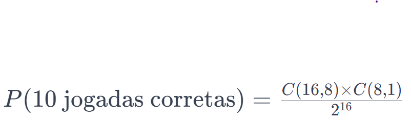
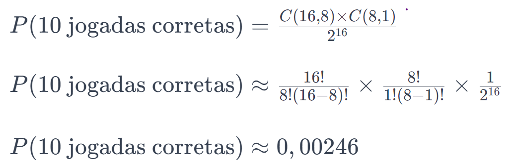
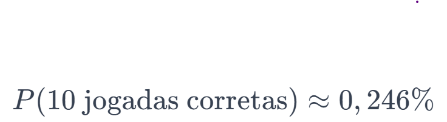

# Jogo da Memória Mais Difícil do Mundo

## Desenvolvedor:
  João Paulo Souza Silva

## Regras do Jogo
O Jogo da Memória é um clássico que desafia a concentração e memorização dos participantes. Em sua versão especial, conhecida como "O Mais Difícil do Mundo", propomos um desafio que testará até mesmo os jogadores mais habilidosos. A dinâmica consiste em encontrar todos os pares de cartas idênticas em um conjunto de 16 cartas embaralhadas. O diferencial desafiador do jogo reside na limitação do jogador a apenas 10 movimentos, enquanto há 8 correspondências a serem encontradas. Isso significa que o jogador pode cometer apenas duas falhas durante todo o jogo.

A complexidade do jogo é ampliada pela baixa probabilidade de um jogador acertar todas as respostas em 10 tentativas ou menos. Para calcular a probabilidade de um jogador alcançar precisamente 10 acertos em um jogo de memória com 16 cartas, utilizamos a fórmula de combinação. A equação é a seguinte

  

Aqui, consideramos que, em 10 jogadas, o jogador encontra 8 pares corretos e comete 2 erros. O termo C(8, 1) representa a escolha de 1 erro em meio às 8 jogadas corretas.

  

Multiplicando por 100 para obter a porcentagem

  

Portanto, a probabilidade de um jogador ter sucesso em exatamente 10 jogadas em um jogo de memória com 16 cartas é de aproximadamente 0,246%. Vale ressaltar que esta estimativa é uma simplificação, baseada em escolhas aleatórias, e pode não representar completamente o comportamento de um jogador real.

Ao iniciar o jogo, o usuário é solicitado a fornecer seu nome como parte do processo obrigatório para iniciar a partida. Após inserir o nome, a tela do jogo é revelada, apresentando uma disposição de 16 cartas em uma área 4x4.

No canto superior central, ao lado do título, um ícone informativo:
 

  

 fornece acesso a informações detalhadas sobre a dificuldade do jogo, oferecendo aos jogadores uma visão clara do desafio que os aguarda.

Logo abaixo do título, um contador regressivo exibe a quantidade de jogadas restantes, proporcionando aos jogadores uma noção precisa das tentativas restantes.

Quanto à disposição e interação com as cartas:
- Cada carta é inicialmente virada para baixo, mantendo seu valor oculto.
- Ao ser selecionada, a carta se vira, revelando seu valor, e sua cor padrão muda para azul.
- O jogador deve escolher duas cartas por jogada.
- Se as duas cartas selecionadas possuírem o mesmo valor, elas se tornam verdes, indicando uma correspondência correta.
- Caso contrário, as cartas ficam vermelhas por um curto período, ocultam seus valores novamente e retornam à cor padrão.

Ao zerar as tentativas ou acertar todas as cartas, uma tela de resultados aparece, exibindo:
- Nome do jogador.
- Indicação se o jogador concluiu ou não o jogo.
- Pontuação obtida.
- Opção de jogar novamente.

Ao escolher a opção 'Jogar Novamente', as cartas são reembaralhadas, o contador de jogadas é reiniciado e os jogadores recebem uma nova oportunidade de superar o desafio. É uma chance de aprimorar suas habilidades e conquistar um desempenho ainda melhor.

## Como jogar

Para aprimorar a experiência durante o jogo, é essencial compreender as regras que o regem. A seguir, encontram-se detalhadamente listadas todas as normas a serem observadas:

 1. Início do Jogo
    1. Ao iniciar o jogo, será solicitado que você informe seu nome para personalizar a experiência.

    2. Uma vez inserido o nome, você será direcionado para o tabuleiro do jogo.

    Obs: O jogo terá início somente após a inserção do nome do jogador.

2. O Tabuleiro
    1. O tabuleiro consiste em várias cartas viradas para baixo, cada uma contendo um letra.
  
    2. Cada letra tem um par correspondente no tabuleiro.

3. Regras
    1. **Jogadas:** Cada jogada consiste em virar duas cartas.
    2. **Objetivo:**  Encontrar todas as cartas correspondentes em pares.
    3. **Limite de Jogadas:** Este jogo tem um desafio especial! Você possui apenas 10 jogadas para completar o tabuleiro.
    4. **Pontuação:** Cada par correspondente revelado contribui para sua pontuação final.
  
4. Como Jogar
    1. **Escolha uma Carta:** Clique em uma carta para virá-la.
    2. **Memorize:** Memorize os símbolos das cartas viradas.
    3. **Escolha Outra Carta:** Clique em outra carta para tentar encontrar seu par correspondente.
    4. **Correspondência:** Se os símbolos coincidirem, as cartas permanecem viradas. Se não, elas são viradas novamente.
    5. **Número de Jogadas:** Você tem apenas 10 jogadas, então escolha sabiamente!

5. Fim do Jogo
    1. O jogo termina quando todos os pares de cartas são encontrados ou quando você atinge o limite de 10 jogadas.
  
    2. Uma mensagem final será exibida com seu nome, desempenho e pontuação.

6. Reiniciar o Jogo
    1. Se desejar jogar novamente, clique no botão "Jogar Novamente" no final do jogo.

## Como executar
O trabalho em questão tem por objetivo fazer interação com o jogador por meio da tela, para acessar a página [Clique Aqui](https://6580544c58f3e64e8795b649--eclectic-beijinho-923dff.netlify.app/)

## Créditos 
Este projeto foi desenvolvido com base na colaboração e troca de conhecimentos entre os colegas que estão trabalhando na mesma atividade. Além disso, contou com o apoio dos recursos oferecidos pelos serviços de chat GPT e chat Bing.

A colaboração entre colegas desempenhou um papel fundamental no desenvolvimento deste projeto. A troca de experiências e ideias contribuiu significativamente para a resolução de desafios e para o aprimoramento das soluções adotadas.

O Chat GPT, um assistente de linguagem natural, ofereceu suporte valioso ao fornecer informações e sugestões durante o desenvolvimento. Sua capacidade de compreensão contextual e geração de texto contribuiu para a resolução de questões específicas do projeto.

Além disso, o Chat Bing também desempenhou um papel importante na obtenção de informações e esclarecimentos específicos. Ao fornecer resultados de busca relevantes, contribuiu para a obtenção de conhecimentos adicionais quando necessário.

Devido à natureza da tarefa e ao nível de dificuldade moderado, não foi necessário recorrer a fontes de pesquisa adicionais. A colaboração entre os envolvidos e o suporte oferecido pelos chats foram suficientes para atender aos requisitos do projeto.

## Licença do projeto
Este projeto, "Jogo da Memória", é disponibilizado sob a Licença Aberta, permitindo o uso, distribuição e modificação por qualquer pessoa, para qualquer propósito, comercial ou não.